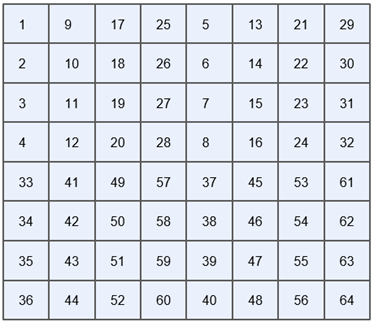

# 基于FPGA的铝材缺陷检测系统

2023年全国大学生集成电路创新创业大赛（集创赛）-海运捷讯杯 全国二等奖作品

本科生团队-冰糖葫芦儿

@copyright 2024.12.2	Jiajun Ji. All rights reserved.

**仓库目录**

.
|`-- Dataset`

|   `-- aluminum_ssd_voc.tar.gz	赛事方提供的铝材数据集`

|`-- Doc			包含赛事方提供的使用文档、以及我们团队的技术文档及PPT`

|   `|-- 答辩PPT.pdf`

|   `|-- \赛事官方文档`

|   `|-- \团队文档`

|   `-- 运行指南.txt`

`
|-- FPGA_Project	FPGA侧部署工程，包括应用程序及Bit流文件`	

|   `|-- C5TB_top.rbf`

|   `|-- C5TB_top.sof`

|   `-- paddle_frame	FPGA侧应用程序`

|`-- Project_Src	工程源码`

|   `|-- FPGA_Src		FPGA侧Quartus工程源码`

|   `|-- Model_Training	基于Paddle的模型训练及压缩源码`

|   `|-- NNA_Src		主办方提供的编译脚本`

|   `-- amm_driver		PS侧Linux的amm驱动程序`

|`-- readme.assets`

## 一、总体概述

### 1.1 系统框图

系统总体运行由HPS端调度，FPGA端作为HPS端并行运行加速部分，主要作用是为HPS端执行卷积加速、HDMI显示等功能，因此，我们可以通过将HPS端执行的数据重排、预处理、resize、plot等操作移动到FPGA端进行并行运行，这样就可以加速整个系统的运行速度。

#### PL PS通信

FPGA端与HPS端沟通主要通过多个总线，有由FPGA端发起的数据传输f2h_sdram总线，f2h_axi总线，也有由HPS下达指令的lw_axi总线。FPGA数据通过总线传输到PS端ddr3中。在Linux系统中FPGA相当于其外设，因此使用的是DMA等驱动对数据进行搬运，传输的数据在Linux系统中处于内核空间，将其搬移到用户空间后我们就可以使用用户程序对数据进行操作。

| 组件名           | 桥接                    | Hps连接端口       |
| ---------------- | ----------------------- | ----------------- |
| mm_bridge_sdram0 | FPGA to SDRAM           | f2h_sdram0_data   |
| mm_bridge_axi    | FPGA-to-HPS             | f2h_axi_slave     |
| mm_bridge_lw_axi | Lightweight HPS-to-FPGA | h2f_lw_axi_master |

#### 部署模型

模型部分是整个系统进行推理的基础，主要分为模型训练以及模型部署，训练框架使用PaddleDetection，推理框架使用Paddle-Lite。针对训练的模型优化，主要集中于模型精度的提升以及模型大小的压缩，针对部署的模型优化，就是在PS端对intel_SDK以及推理框架Paddle-Lite的优化。

### 1.2 优化策略

#### FPGA侧

本系统通过**重写**dvp_ddr3、ddr3_vga等官方ip，利用FPGA并行计算的优势，将HPS部分推理流程中的多个任务**并行**到FPGA实现，例如对图像的**resize**以及推理结果的**plot**叠加。同时通过**时序约束**、**逻辑固化、去除无用组件**等方式提高cnn加速器的运行频率，加速了HDMI显示刷新速度以及推理速度。

#### 模型侧

在模型方面，我们通过使用**本地数据增强**、使用**剪枝策略**进行剪枝、优化**小目标检测精度**、进行**输出层缩放**、修改**单通道模型**等方式提升模型精度并压缩模型大小。

#### Linux侧

在SDK以及推理框架Paddle-Lite方面，我们使用**Neon**指令集、开启**O3**优化、使用**OpenMP**、进行**循环展开**等方式优化了PS端的数据重排。在Paddle-Lite中**开启多核心推理**，推理过程使用**单通道模型与数据**，加速推理速度。

在构建实时推理系统时，使用一个SSD_Detection进程，完成实时推理的刷新工作，每完成一帧的推理，将推理结果写入PL_Plot控制寄存器中，从而完成HDMI上的实时推理结果叠加显示。而推理工作，将完全由FPGA进行，当DVP_DDR模块将图像写入BUF0时，DDR_VGA模块从BUF1中读取数据并使用PL_Plot模块叠加预测框，完成推理结果的显示以及视频流刷新工作。

### 1.3 程序架构

在总决赛中，我们抛弃了分区赛使用的双进程方案，引入PL端绘制预测框思想，从而可将双核ARM-A9全部用于推理，有效提升CPU的利用率，并且解决了双进程读取DDR冲突的问题，通过改方法，可以提升推理刷新时间稳定性，并可将推理时间提升10ms。下面我们将两种方案都进行阐述，进行比较。

#### 总决赛方案

我们设计了PL端绘制预测框的IP，通过h2f_lw_bridge控制状态寄存器，从而控制PL_Plot IP的绘制，其状态寄存器说明如下图所示。

我们设计了一个SSD_Detction进程，其从BUF2~BUF3中读取经过PL侧Resize后的300*300单通道图像，转换为Tensor结构后进行使用PaddleLite推理，将推理结果写入PL_Plot寄存器，从而实现推理结果的叠加显示。

#### 分区赛方案

我们的系统将使用**两个进程**完成，他们中间通过共享内存的方式进行进程间通信。他们分别的工作是：

1. 进程ssd_detection用于从ddr中获取原始图像数据，进行模型的推理。并将PaddleLite推理结果拷贝入共享内存，给进程2使用。
2. 进程ssd_hdmi用于从ddr中获取图像原始数据，从共享内存中拷贝推理结果，并使用visualize_result()函数将推理结果叠加到原图像，通过ddr_vga IP将叠加后的图像推流到HDMI显示。

由于使用两个进程，其推理与HDMI视频流推流过程是**独立**的，在推理结果并未刷新前，原图像叠加上一次的推理结果进行输出，其相互独立互不影响。

注：由于ssd_hdmi进程运行较快，为了降低CPU资源占用，我们使用usleep() 函数将进程休眠，并且由于系统中大部分进程均运行于cpu0上，为了保证推理速率，我们将ssd_hdmi视频推流进程绑定于cpu0运行，推理进程ssd_detction独占cpu1。并提高推理进程ssd_detction的任务优先级为0，降低视频推流进程ssd_hdmi的任务优先级为**39**。如此可减少两个进程对于资源的抢占，在不降低视频流帧率的情况下，加快推理速度。

## 二、关键技术分析

### 2.1 FPGA端优化

#### 重写dvp_ddr3与ddr3_vga

由于官方提供的dvp_ddr3以及ddr3_vga的两个ip，其需要使用HPS端进行调度，严重影响推理程序的速度，同时HDMI速度也受到损失，因此最好能够将HDMI显示完全与HPS端分离，得到的帧数据直接传输到HPS端DDR3的指定双buffer中，从buffer直接读取数据然后推理，这样无需PS调度，加快了推理速度同时加快了HDMI显示速度。

同时，官方提供的ip我们无法进行自定义的修改，如修改为单通道、将resize、图像预处理模块添加进入ip中。通过自定义ip，我们可以将想要实现的操作加入模块ip中，以提升推理准确度、推理速度等指标。

为了便于移植，我们将dvp_ddr3与ddr3_vga整合为一个ip即dvp_ddr3_vga。

**•绘制dvp_ddr3_vga总体框图如下：**

**•dvp_ddr3_vga****模块组成如下：

| 模块名称         | 功能描述                                                     |
| ---------------- | ------------------------------------------------------------ |
| **Top**模块      |                                                              |
| dvp_ddr3_vga_top | 例化dvp_ddr3_top、ddr3_vga_top模块，并完成相应读写逻辑的控制。 |
| **dvp_ddr3**模块 |                                                              |
| dvp_ddr3_top     | 例化dvp_rgb888、ddr3_write、dvp_ddr3_ctrl，并产生相应帧写逻辑。 |
| dvp_rgb888       | DVP数据采集模块，将8位的DVP数据转换为128位并生成相应的写请求送给ddr3_write模块，此外还需要产生场同步开始与结束信号交给dvp_ddr3_top模块产生相应帧写逻辑。 |
| ddr3_write       | 接收dvp_rgb888传来的128位数据，在dvp_ddr3_top控制逻辑下通过f2h_axi_slave完成对ps端ddr3的突发写操作。 |
| dvp_ddr3_ctrl    | dvp_ddr3控制IP，包含了状态控制寄存器，可启动IP运行并读取写状态。 |
| **ddr3_vga**模块 |                                                              |
| ddr3_vga_top     | 例化vga_ctrl、ddr3_read、ddr3_vga_ctrl，并产生相应帧读逻辑。 |
| vga_ctrl         | 从ddr3_read中获取128位数据将其转换位24位rgb数据并以vga时序输出，vga驱动时钟为5M时钟。此外还需要产生场同步开始与结束信号交给ddr3_vga_top模块产生相应帧读逻辑。 |
| ddr3_read        | 在vga_ctrl的读请求下提供相应的128位数据。在ddr3_vga_top控制逻辑下通过f2h_axi_slave完成对ps端ddr3的突发读操作。 |
| ddr3_vga_ctrl    | ddr3_vga控制IP，包含了状态控制寄存器，可启动IP运行并读取写状态。 |

图2.1.1以及表2.1.1，展示了dvp_ddr3_vga模块其组成以及各模块作用，其中，最重要的模块就是接收dvp时序的dvp_rgb888以及转换vga时序的vga_ctrl模块，以及负责使用avalon总线写入读出ddr3的ddr3_read、ddr3_write模块。

dvp_rgb888模块接收vcam传来的dvp数据，将其寄存为ddr3_write的128位数据写入ddr3_write的FIFO中，当ddr3_write的FIFO中数据深度达到突发长度16时，ddr3_write进行一次突发写，将连续16个128位数据通过f2h_axi_slave总线写入PS端ddr3的buffer中，其中ddr3_write写入是以帧为开始和结束。

ddr3_read模块通过f2h_axi_slave总线从ps端ddr3中的buffer读取dvp_ddr3模块写入的帧，一次突发读取16个128位数据，将其存储在模块内部的FIFO中，当vga_ctrl发起一次读请求时，在读时钟下，每一个时钟周期向外输出128位数据。

由于vga_ctrl在vga时钟下需要输出的是24位rgb_888像素，因此使用移位寄存器向外输出24位数据，需要满足位宽可以被24整除。读请求有效情况下，ddr3_read一个时钟输出128位数据，128无法被24整除，而384可以被24整除。因此vga_ctrl一个读请求我们需要持续三个时钟周期，也就是连续输出3个128位数据，即384位数据。

在vga时钟驱动下，每个时钟周期vga_ctrl模块向外输出24位数据，同时产生同步的vga_vsync、vga_de等同步信号。

vga时钟我们按满帧计算，一个时钟输出一个24位数据：

$400*320*30=3840000=3.84MHz$  

上述时钟不满足5M时钟，我们定义vga时序如下：

| 400*320@30 | 行同步 | 场同步 |
| ---------- | ------ | ------ |
| 同步SYNC   | 40     | 40     |
| 后沿BACK   | 0      | 20     |
| 有效VALID  | 400    | 320    |
| 前沿FRONT  | 0      | 0      |
| 周期TOTAL  | 440    | 380    |

计算实际的vga时钟如下：

$440*380*30=5016000≈5MHz$

该时钟可以保证显示帧率为满30帧。

**•dvp_ddr3_vga*端口如下：

图2.1.2 dvp_ddr3_vga模块端口

**•dvp_ddr3_vga****模块信号功能说明如下：

表2.1.3 dvp_ddr3_vga模块信号功能说明

| 信号                                   | 位宽 | **I/O** | 功能                                                         |
| -------------------------------------- | ---- | ------- | ------------------------------------------------------------ |
| clk                                    | 1    | I       | 系统时钟                                                     |
| reset_n                                | 1    | I       | 低电平复位                                                   |
| **dvp**时序输入接口                    |      |         |                                                              |
| dvp_pclk                               | 1    | I       | 摄像头像素时钟                                               |
| dvp_href                               | 1    | I       | 摄像头行同步信号                                             |
| dvp_vsync                              | 1    | I       | 摄像头场同步信号                                             |
| dvp_data                               | 8    | I       | 摄像头图像数据                                               |
| **dvp_slave**控制接口(avalon_mm_slave) |      |         |                                                              |
| dvp_chipselect                         | 1    | I       | 片选信号，当该信号有效时，IP 核的所有寄存器才能被访问。      |
| dvp_as_address                         | 2    | I       | 地址，该地址信号指定了 IP 核被访问的寄存器编号，通过给该信号赋予不同的值，就能选择访问不同的寄存器。 |
| dvp_as_write                           | 1    | I       | 写请求信号，当该信号有效时，writedata 端口上的数据会被写入 address 指定的寄存器中。 |
| dvp_as_writedata                       | 32   | I       | 写数据信号，当 write信号有效时，该端口上的数据会被写入 address 指定的寄存器中。 |
| dvp_as_read                            | 1    | I       | 读请求信号，当该信号有效时，readdata 端口上的数据会被写入 address 指定的寄存器中。 |
| dvp_as_readdata                        | 32   | O       | 读数据端口，当 chipselect 有效时，该端口上的值为 address 指定的寄存器中的值。 |
| **dvp_master**写接口(avalon_mm_master) |      |         |                                                              |
| dvp_master_address                     | 32   | O       | address信号代表一个字节地址                                  |
| dvp_master_write                       | 1    | O       | 置位表示一个write传输，如果存在，则需要writedata             |
| dvp_master_byteenable                  | 16   | O       | 字节使能。byteenable 中的每个比特对应于writedata和readdata中一个字节。 |
| dvp_master_writedata                   | 128  | O       | 写传输的数据                                                 |
| dvp_master_burstcount                  | 5    | O       | 突发的传输数量，dvp写突发长度为16                            |
| dvp_master_waitrequest                 | 1    | I       | 当 slave无法响应读写请求时，置位waitrequest，强制master等待； |
| **dvp_wire**测试接口                   |      |         |                                                              |
| dvp_cnt_go                             | 8    | O       | 记录hps发出的请求次数                                        |
| **vga**时序输入接口                    |      |         |                                                              |
| vga_clk                                | 1    | O       | 输出vga时钟,频率5MHz                                         |
| vga_de                                 | 1    | O       | 有效数据选通信号DE                                           |
| vga_vsync                              | 1    | O       | 输出场同步信号                                               |
| vga_hsync                              | 1    | O       | 输出行同步信号                                               |
| vga_rgb                                | 24   | O       | 输出24bit像素信息                                            |
| **vga_slave**控制接口(avalon_mm_slave) |      |         |                                                              |
| vga_chipselect                         | 1    | I       | 片选信号                                                     |
| vga_as_address                         | 2    | I       | 地址                                                         |
| vga_as_write                           | 1    | I       | 写请求信号                                                   |
| vga_as_writedata                       | 1    | I       | 写数据端口                                                   |
| vga_as_read                            | 1    | I       | 读请求信号                                                   |
| vga_as_readdata                        | 32   | O       | 读数据端口                                                   |
| **vga_master**读接口(avalon_mm_master) |      |         |                                                              |
| vga_master_address                     | 32   | O       | address信号代表一个字节地址                                  |
| vga_master_read                        | 1    | O       | 置位表示一个read传输，如果存在，则需要readdata               |
| vga_master_byteenable                  | 16   | O       | 字节使能                                                     |
| vga_master_readdata                    | 128  | I       | 写传输的数据                                                 |
| vga_master_burstcount                  | 1    | O       | 突发的传输数量，vga读突发长度为1                             |
| dvp_master_waitrequest                 | 1    | O       | 当 slave无法响应读写请求时，置位waitrequest，强制master等待； |
| vga_master_readdatavalid               | 1    | I       | 读数据有效信号                                               |

 

图2.1.2以及表2.1.3，展示了dvp_ddr3_vga模块的端口信号，并详细描述了端口信号的功能，对于细节的dvp_rgb888、vga_ctrl的时序等问题，我们将其放在2.1.2节中进行详细叙述。

**•dvp_ddr3_vga**状态控制寄存器说明如下：

| 寄存器名称          | 地址 | 位宽 | R/W  | 功能说明                                                     |
| ------------------- | ---- | ---- | ---- | ------------------------------------------------------------ |
| control             | 0    | 32   | W    | bit0:单次传输触发位，该位仅在主机写该寄存器且写入数据的bit0位为1时为高电平，否则保持低电平，对应于control_go信号。对于双buffer连续读写情况，无需ps控制时，该位无效。  bit[2:1]:预留的使能控制信号，对应于control_en。 |
| control_user_base   | 1    | 32   | W    | PL从PS侧DDR3突发读数据的物理首地址。                         |
| control_user_length | 2    | 32   | W    | 一帧图像数据量，以Byte为单位。                               |
| control_state       | 3    | 32   | W/R  | bit0:为方便PS端搬运图像，dvp连续写双buffer的状态位，利用该位PS端可读取空闲buffer;  dvp向buffer0写完一帧图像，则向control_state写1;  dvp向buffer1写完一帧图像，则向control_state写0; |

表2.1.4 dvp_ddr3状态控制寄存器说明

 

表2.1.4是针对dvp_ddr3这个模块的状态控制寄存器的说明，ddr3_vga模块和该模块类似，此处不再赘述。

上述寄存器（除control_state）只有在不使用双buffer连续传输时起用，使用双buffer连续传输时，由于需要写的两个buffer地址以及写长度在写ip时已经固定了，无需通过PS进行启动与赋地址。

#### 双Buffer连续传输

如果在PS端发起传输一帧的命令给dvp_ddr3模块以获取一帧图像，需要等待的时间是：

dvp_ddr3模块一帧传输完成时间+memcpy的时间

为了ps端获取帧图像的即时性以及减少PS端复制内存的时间开销，我们使得FPGA端不需要通过ps端进行写入。因为dvp时钟为11.5MHz，vga时钟为5MHz，而dvp一个时钟周期传输8位，vga一个时钟周期传输24位，因此vga的速度快于dvp速度，也就是dvp写完一帧的速度更慢，因此我们可以以dvp写入一帧是否完成为标志位，使用乒乓操作的原理进行双buffer连续写操作。

双buffer写状态机如下：

图2.1.3 dvp_ddr3_vga_top的读写状态机

该状态机初始状态为IDLE，启动后自动进入Wbuffer0状态，dvp_ddr3模块写入一帧给buffer0，当写完buffer0时，ddr3_write置位dvp_done表示一帧写完，使用边沿检测dvp_done上升沿得到dvp_done_posedge信号，该信号只持续一个时钟周期，检测到该信号代表一帧写完。因此写完buffer0时，转换状态为wbuffer1_rbuffer0，即dvp写buffer1，vga读buffer0。再次检测到dvp_done_posedge时，转换状态为Wbuffer0_rbuffer1，即dvp写buffer0，vga读buffer1，如此一来

就可以使得双Buffer连续传输得以实现。

使用双buffer连续传输意味着HDMI显示完全由PL端控制，无需PS端进行控制，但是由于我们需要在显示上叠加推理结果框等，想要完全实现双buffer连续传输，我们需要实现PL端绘制推理结果框。在没有实现上述模块时，我们只让dvp_ddr3由PL端控制，ddr3_vga的地址切换由PS端控制，因此buffer结构如下：

图2.1.4 普通的四buffer

使用上面结构主要是为了防止hps读取与dvp写入到同一片空间产生冲突，同时可以使得dvp写入满帧率，vga读出满帧率(hps的memcpy速度远大于显示速率)。

#### 单通道显示及推理

**•dvp_rgb888****时序**

**对于三通道：**

三通道需要传输400*320*3个字节，读取一个1个128位数据可以传16个字节，一行400个像素有1200个字节，一共需要写入75个128位数据才能传输完成400个像素。

三通道信号时序如下图：

       

图2.1.5 三通道dvp_rgb888的时序

**对于单通道：**

单通道只需要传输400个字节，一共需要写入25个128位数据才能传输完成400个字节。与三通道时序不同的是，隔一个通道取一次，因此我们将原dvp_pclk进行三分频再使用该三分频时钟进行采样，在fpga工程中将该时钟约束为全局时钟，即可使得该时钟与dvp_pclk时钟同步。我们也可以使用pll产生dvp_pclk的三分频时钟，这样可以保证该时钟与dvp_pclk时钟是同步的。

单通道采样信号时序如下图：

图2.1.6 单通道dvp_rgb888的时序

**•vga_ctrl****时序图**

**对于三通道：**

由于是三通道，一个像素24位，而我们一次读取的数据位宽是128位，无法形成整除关系，因此需要将读取的128位数据凑成384位，这样384/24=16就可以被整除传输16个像素。对于一行400个像素，我们一共需要读25次384位数据，一次读请求为三个时钟周期宽。

需要注意，此处vsynv场同步信号高电平为有效，低电平为同步。

以下是第一行对应的时序图：

图2.1.7 三通道vga_ctrl的时序

**对于单通道：**

与三通道不同的是，读请求宽度为一个时钟周期，读请求只超前vga_de四个时钟周期，即请求一次读128位，不是三通道的384位，这是因为单通道一个时钟周期移位寄存器只输出8位，输出的24位像素的三个通道是一样的，因此，128位可以输出16个24位像素。其时序与三通道相似，因此不再放出时序图。

使用单通道后，每帧图像写入减少了2/3的大小，原来需要写入400*320*3，现在只需要写入400*320大小的图像。这样在DDR3中占用的空间直接减少了2/3，同时大大减轻了F2H总线的负担。

#### 使用FPGA实现图像预处理中的resize

在推理时，SSD_Monlienetv1模型要求所有输入图像都必须为同样大小，这是由于其特侦图大小以及先验框数目都必须根据输入图像大小确定，因此我们在进行推理时所有输入图像在输入网络前都必须经过resize操作将其变为统一大小300*300。根据我们的测量，400*320*3图像resize为300*300*3大小所花费的时间为7ms。在踏入了100ms的推理时间后，每一点提升都弥足珍贵，更不必说7ms的提升了，因此我们完成了将resize操作转移到PL端实现的方式完成图像预处理的并行化。

在原推理程序中，我们使用CV库中的双线性插值法对图像进行resize，因此我们为了追求与原程序效果一致，我们在PL端实现的resize操作原理也是双线性插值。

**·具体原理如下：

图2.1.8 双线性插值原理

在实际的使用中：

(1) 我们令x_ratio和y_ratio代表原始图像与缩放后图像在水平和垂直方向上的比率，即步进。

(2) 根据x_ratio和y_ratio，计算缩放后图像坐标(i,j)到到原始图像坐标的映射，其中整数部分作为原始图像的像素坐标(x,y)，小数部分作为像素灰度值的权重也就是  α和  β。实际上以行为例，本步的操作就是利用缩放后图像前i-1行乘上竖直的缩放比例y_ratio，计算缩放后图像的第i行在原始图像中的行位置，然后取其整数为原始图像的起始行，小数部分作为加权值α和  β 。

(3) 根据像素坐标(x,y)我们可以得到原始图像四邻域的像素灰度值img1(y:y+1,x:x+1)，根据 α和  β可以得到四邻域水平方向上的像素权重1-α和  α以及四邻域竖直方向上的像素权重1-β 和 β，四邻域像素与权重的乘累加和，作为放大后的图像的近似灰度值img2(i,j)。

**·根据以上原理**，我们可以实现其FPGA**版本操作:**

(1)对原始图像进行行缓存

由于双线性插值需要利用近邻4个像素进行计算并获得目标像素值，所以至少需要缓存两行像素。我们利用双端口BRAM对原始图像进行行缓存。我们需要将400*320的像素缩小为300*300，因此缓存一行原始图像像素至少需要400个BRAM地址空间，为了使得我们的IP可以在一定范围内适应输入图像大小变化，此处将BRAM一行像素空间定义为1024，同时定义BRAM最大可以存储4行像素，因此BRAM的深度为4096，而BRAM的宽度等于像素位宽也就是8。

同时我们进行双线性插值时，需要同时从BRAM 中读出近邻4个像素,我们为了降低设计难度，采用4个BRAM对图像进行行缓存，每个BRAM分别输出近邻4个像素中的其中1个。如下图所示：

图2.1.9 BRAM的存储结果

可以看到其中图像奇数行像素同时存于BRAM0和BRAM1中，偶数行像素同时存于BRAM2和BRAM3中。因此BRAM0、BRAM1、BRAM2和BRAM3分别输出左上角、右上角、左下角、右下角的像素。

将原始图像存入 BRAM之前，需要产生相应的 BRAM 地址。根据原始图像的场信号per_img_vsync和行信号 per_img_href，对原始图像进行列统计img_hs_cnt ϵ [0,C_SRC_IMG_WIDTH-1]和行统计img_vs_cnt ϵ

 [0,C_SRC_IMG_HEIGHT-1]，其中C_SRC_IMG_WIDTH和C_SRC_IMG_HEIGHT分别表示原始图像的宽度和高度。BRAM地址的计算公式如下所示，其中img_hs_cnt用于产生行内像素的地址、img_vs_cnt[2:1]用于产生不同行的基地址。
$$
\mathrm{bram}_{-}a_{-}\mathrm{waddr}=
\begin{Bmatrix}
\mathrm{img}_{-}\mathrm{vs}_{-}\mathrm{cnt}[2:1],10^{\prime}\mathrm{b}0
\end{Bmatrix}+\mathrm{img}_{-}\mathrm{hs}_{-}\mathrm{cnt}
$$
一个BRAM大小为4*1024代表4行。因此使用img_vs_cnt[2:1]产生这四行的地址，然后再使用img_hs_cnt产生其行内像素的地址。img_hs_cnt计数的行上限受输入图像dvp行有效信号限制，其上限为输入原始图像行长度。为什么使用img_vs_cnt[2:1]产生这四行的地址我们讲完写使能就知道了。

写地址解决了，接下来是写使能问题，由于BRAM0和BRAM1存储的行是奇数行，BRAM2和BRAM3存储的行是偶数行，因此我们只需要生成两个写使能信号可以对当前有效行数是奇数还是偶数进行判断即可，这很简单。因此我们的写使能信号在场同步有效以及行同步有效时，使用img_vs_cnt[0]判断当前行是奇偶，这是因为img_vs_cnt[0]在最开始第1行时为0，代表奇数行，第二行时为1代表偶数行，如此往复我们就可以通过img_vs_cnt[0]判断奇偶行。

因此我们使用img_vs_cnt[0]以及其取反信号分别可以生成奇数行和偶数行的写使能信号，在我们的代码里bram1_a_wenb为BRAM0和BRAM1的写使能，bram2_a_wenb为BRAM2和BRAM3的写使能。以上两个写使能信号分别控制两个BRAM。

而写地址信号则同时控制4个BRAM，因此如果要使用写地址信号对BRAM0和BRAM1以及BRAM2和BRAM3分别进行写地址的变化重点就在于使用img_vs_cnt[2:1]。因为两组BRAM的写使能信号是轮流有效的，因此写地址信号在前一行属于第一组BRAM，后一行属于第二组BRAM，而img_vs_cnt[2:1]每经过两行增加1，刚好与写使能信号匹配，这样两组BRAM在写入行地址时是同步变化的，这样经过8个行周期，一共有四对奇偶行就分别写入了两组BRAM。

(2)当每行像素缓存到BRAM后，将行统计img_vs_cnt作为标签存入异步FIFO中后续进行双线性插值放大算法时，会根据该标签判断BRAM中是否已经缓存了插值所需要的两行像素。

(3)在进行双线性插值算法之前，需要计算原始图像与目标图像在水平和垂直方向上的比率(即目标图像映射到原始图像的坐标步进)C_X_RATIO和C_Y_RATI O。已知原始图像的分辨率为400x320、目标图像的分辨率为300x300，且要求将比率定标为16位小数，故C_X_RATIO和C_Y_RATIO的计算结果如下:
$$
C_{-}X_{-}\mathrm{RATIO}=\mathrm{floor}\left(\frac{C_{-}SRC_{-}IMG_{-}\mathrm{WIDTH}}{C_{-}DST_{-}IMG_{-}\mathrm{WIDTH}}\times2^{16}\right)=\mathrm{floor}\left(\frac{400}{300}\times2^{16}\right)=87381C_{-}Y_{-}\mathrm{RATIO}=\mathrm{floor}\left(\frac{C_{-}SRC_{-}IMG_{-}\mathrm{HEIGHT}}{C_{-}DST_{-}IMG_{-}\mathrm{HEIGHT}}\times2^{16}\right)=\mathrm{floor}\left(\frac{320}{300}\times2^{16}\right)=69905
$$

注意C_X_RATIO和C_Y_RATIO需要使用17’进行存储

(4)目标图像的坐标(y_cnt,x_cnt)及目标图像映射到原始图像的坐标(y_dec,x_dec)均由控制器负责完成。下图所示为控制器状态机，控制器状态跳转的说明，如表所示。

图2.1.10 坐标映射的状态机控制

表2.1.5 状态跳转说明

| **状态名**   | **功能描述**                                                 |
| ------------ | ------------------------------------------------------------ |
| S_IDLE       | S_IDLE状态中，当FIFO非空时，若FIFO中的标签img_vs_cnt不为0，且目标图像最后一行像素的最近邻插值已经完成(即y_cnt==C_DST_IMG_HEIGHT)，则进入S_RD_FIFO状态;否则进入S_Y_LOAD状态 |
| S_Y_LOAD     | S_Y_LOAD状态中，对目标图像映射到原始图像的Y标y_dec进行四舍五入计算。由于y_dec[26:16]是整数部分、y_dec[15:0]是小数部分，故四舍五入结果为y_dec[26:16]+y_dec[15:0]。若结果小于等于img_vs_cnt，则说明BRAM 已经缓存了插值所需要的两行像素，进入S_BRAM_ADDR状态;否则进入S_RD_FIFO状态 |
| S_BRAM_ ADDR | S_BRAM_ ADDR状态中，生成目标图像的X坐标x_cnt、目标图像映射到原始图像的X坐标x_dec，完成后进入S_Y_INC状态 |
| S_Y_INC      | S_Y_INC状态中，生成目标图像的Y坐标y_cnt、目标图像映射到原始图像的Y坐标y_dec，若y_cnt等于目标图像最后一行C_DST_IMG_HEIGHT-1时，则进入S_RD_FIFO状态;否则，进入S_Y_LOAD状态 |
| S_RD_FIFO    | S_RD_FIFO状态中，将FIFO中的标签读出，进入S_IDLE状态          |

(5)根据(y_dec,x_dec)可以得到近邻 4个像素中左上角像素的像素级坐标整数部分(y_int_c1,x_int_c1，以及(y_dec,x_dec)与近邻4个像素的水平和垂直距离x_fra_c1、inv_x_fra_c1、y_fra_c1、inv_y_fra_c1，也就是小数部分，相当于我们上面的   和   ，   和   。

(6)将(y_int_c1,x_int_c1)转为BRAM的读地址bram_addr_c2，以及根据x_fra_c1、inv_x_fra_c1、y_fra_c1、inv_y_fra_c1计算近邻4个像素的权重frac_00_c2、frac_01_c2、frac_10_c2、frac_11_c2，分别代表左上右上左下右下角的像素。其中bram_mode_c2用于指示左上角像素位于图像奇数行或偶数行，其值为0时表示奇数行，为1时表示偶数行。

(7)根据bram_mode_c2产生近邻4个像素在4个BRAM中的读地址，注意，如果左上角像素位于奇数行，则可以将下一行取为偶数行，地址是顺着取的。如果左上角像素位于偶数行，则下一行应该为奇数行，地址需要跳一行取才行。

(8) 根据4个BRAM的读地址从BRAM中读出4个像素并映射到近邻4个像素的位置上。

(9) 得到的近邻4个像素中可能存在像素超出图像边界的情况，需要进行像素的边界复制，像素越界处理。如果边界超出图像边界，则对像素进行复制处理。

(10)将近邻4个像素与(6)中计算的各自的权重相乘后累加，得到目标像素的灰度值

(11)由于计算得到的目标像素灰度值值可能大于 255为了避免像素值越界，将灰度值大于 255 的像素，直接输出255，灰度值越界处理。

注意，以上所有操作，只有写入使用原始图像时钟，其余所有操作使用缩放图像时钟。

**·resize**模块的组成：

表2.1.6 resize模块组成

| 模块名称               | 功能描述                                                     |
| ---------------------- | ------------------------------------------------------------ |
| resize_top             | 例化rgb2gray、bilinear_interpolation、dvp_gray               |
| rgb2gray               | 将输入三通道的dvp时序转为单通道dvp时序输出，也就是将rgb转为灰度图的dvp时序输出 |
| bilinear_interpolation | 实现双线性插值，输入为灰度的400*320原图像，输出为经过resize的300*300的单通道灰度图像，其帧时序与原 |
| dvp_gray               | 就是原来的dvp_rgb888，为了防止模块冲突进行了重命名，作用是将bilinear_interpolation模块输出的dvp时序转换为ddr3_write可以接收的输入 |

**·使用resiz**后的**buffer**结构：

​                      图2.1.11 使用resize后的buffer结构

使用resize的buffer结构如上，使用单通道的resize图像大小为300*300，因此只占用buffer4和buffer5的前300*300的空间。resize与dvp是帧同步的。

#### PL侧绘制预测框

在上文中，我们为了保证推理刷新以及HDMI刷新互不影响，我们使用了两个核心分别运行两个程序并行执行达到同时完成两个任务的功能。其根本就是为了达到并行工作，既然能在PS端并行，为何我们不能在FPGA端并行呢？这与我们使用FPGA端进行resize是一样的思路。如果我们需要HDMI刷新与推理刷新完全独立的话，我们需要使用双buffer连续传输，但是阻碍我们将HDMI刷新并行到FPGA的唯一阻碍就是我们需要在HDMI显示叠加了推理结果的图像，目前我们是在PS端将推理结果绘制在原图像上再写入DDR供vga读取，因此在这里我们将PS端推理得到的推理结果传入FPGA，FPGA根据结果实时的在PL端的vga图像中叠加结果，这样PS端只用单独运行推理刷新程序，将其推理结果单方面的给FPGA即可实现绘框。

使用PL端绘制预测框，根本改进在于，完全不需要ps端进行内存复制，也就是dvp和vga是完全相关的，也就是dvp连续写，vga连续读，dvp写以及vga读地址切换直接由PL端控制，HDMI显示唯一需要与ps端进行通信的就是推理结果的通信，同时该通信是单方向的，即推理程序发给FPGA无需管是否接收。

搭建的pl_plot模块其构成如下：

表2.1.7 pl_plot模块组成

| 模块名称      | 功能描述                                                     |
| ------------- | ------------------------------------------------------------ |
| vga_ctrl      | 生成VGA有效显示像素坐标交给flag_generate，并利用传入框数控制框的显示，同时作为顶层模块例化flag_generate，并产生相应VGA时序 |
| flag_generate | 生成一个由框、标签、置信度组成的显示单元                     |
| bin2bcd       | 将传入的置信度二进制转换为BCD码给flag_generate模块选择字模   |

实现该模块的思路就是，我们以框、标签、置信度作为一个显示单元，使用一个模块对其进行控制，通过重复例化该模块，我们可以控制显示单元的个数，也就是最多可以显示多少个框、标签以及置信度显示单元，同时将各个模块输出进行或操作就可以在显示图像中显示多个显示单元。

每一次显示我们需要PS端传入的参数有框数、每个框的标签、框的位置以及该标签的置信度。一个显示单元需要显示框、标签以及置信度。其中，框的显示我们只需要传入框的左上角坐标以及右下角坐标即可绘制矩形框，标签一共有四个，而置信度的数字我们限制为四位小数，因此需要显示的字模如下：

数字：0，1，2，3，4，5，6，7，8，9，.

标签：ca_shang、zhen_kong、zhe_zhou、zang_wu

其中，对于标签我们可以直接将这四种标签直接整体转换为字模进行显示，对于置信度我们就需要将PS端传入的二进制置信度转换为五个二进制BCD码，分别对应个位以及四个小数位，通过BCD码对当前位显示的数字字模进行选择。

数字字模大小为16*16，字宽和字高设置为16*16。对于标签，我们直接生成四个标签对应的字模，无需分开生成，所有字符的高度都必须相等，因此我们需要将其生成的字模调整高度统一为16。以上字模我们将其存储在一维数组中，在综合时会被综合为ROM。

表2.1.8 标签字模

| **ca_shang**                                                 | **zhen_kong**                                                | **zhe_zhou**                                                 | **zang_wu**                                                  |
| ------------------------------------------------------------ | ------------------------------------------------------------ | ------------------------------------------------------------ | ------------------------------------------------------------ |
| 0000000000000000;  0000000000000000;  0000000000000000;  0000000040000000;  0000000040000000;  0000000040000000;  0000000040000000;  3C3C003C5E3C5E3E;  4646006662466244;  400E0060420E4244;  4076001C4276423C;  4246004242464240;  664E0066424E427C;  383A003C423A4246;  0000000000000042;  0000FF000000007C; | 000000000000000000;  000000000000000000;  000000000000000000;  004000000040000000;  004000000040000000;  004000000040000000;  004000000040000000;  7E5E3C5E004C3C5E3E;  0C6246620058466244;  08427E420078424244;  10424042006842423C;  204242420044424240;  60426642004666427C;  7E421C420042184246;  000000000000000042;  00000000FF0000007C; | 0000000000000000;  0000000000000000;  0000000000000000;  0040000000400000;  0040000000400000;  0040000000400000;  7E40000000400000;  FE5E3C007E5E3C42;  0E6246000C624642;  1C427E0008424242;  3842400010424242;  7042420020424246;  FF4266006042666E;  FF421C007E42183A;  0000000000000000;  000000FF00000000; | 00000000000000;  00000000000000;  00000000000000;  00000000000000;  00000000000000;  00000000000000;  00000000000000;  7E3C5E3E00DB42;  0C46624400DA42;  080E4244005A42;  1076423C006A42;  20464240006646;  604E427C00646E;  7E3A424600243A;  00000042000000;  0000007CFF0000; |

表2.1.9 数字字符字模

| **小数点****.**                                              | **0**                                                        | **1**                                                        | **2**                                                        | **3**                                                        | **4**                                                        | **5**                                                        | **6**                                                        | **7**                                                        | **8**                                                        | **9**                                                        |
| ------------------------------------------------------------ | ------------------------------------------------------------ | ------------------------------------------------------------ | ------------------------------------------------------------ | ------------------------------------------------------------ | ------------------------------------------------------------ | ------------------------------------------------------------ | ------------------------------------------------------------ | ------------------------------------------------------------ | ------------------------------------------------------------ | ------------------------------------------------------------ |
| 00;  00;  00;  00;  00;  00;  00;  00;  00;  00;  00;  00;  F0;  60;  00;  00; | 00;  00;  18;  7E;  7E;  E7;  E7;  E7;  E7;  E7;  E7;  E7;  7E;  3C;  00;  00; | 00;  00;  00;  1C;  3C;  7C;  7C;  1C;  1C;  1C;  1C;  1C;  1C;  1C;  00;  00; | 00;  00;  18;  7E;  FE;  E7;  07;  0E;  0E;  1C;  38;  70;  FF;  FF;  00;  00; | 00;  00;  18;  7E;  FF;  E7;  06;  1E;  1E;  07;  47;  E7;  7E;  7C;  00;  00; | 00;  00;  04;  0E;  1E;  1E;  3E;  7E;  6E;  EE;  FF;  FF;  0E;  0E;  00;  00; | 00;  00;  00;  7E;  7E;  E0;  FC;  FE;  C7;  07;  47;  C7;  FE;  7C;  00;  00; | 00;  00;  0C;  1C;  1C;  38;  78;  7E;  E7;  E7;  E7;  E7;  FF;  7E;  00;  00; | 00;  00;  00;  FF;  7F;  06;  0E;  0C;  1C;  18;  38;  38;  38;  70;  00;  00; | 00;  00;  10;  7E;  EE;  E7;  E6;  7E;  FE;  E7;  C7;  E7;  FE;  7E;  00;  00; | 00;  00;  18;  7E;  EE;  E7;  C7;  E7;  FE;  7E;  1C;  18;  38;  70;  00;  00; |

除了上述问题外，我们需要着重解决的一个问题是，从PS端得到的置信度是二进制的，我们在发送给fpga端前将其乘上10000取整发送，也就是相当于只取小数点后四位。因此我们需要提取置信度的个十百千万位用以选择在置信度区域需要显示的数字组合。

二进制转BCD我们使用“加3移位法”。

首先，我们需要得到五个BCD码，因此二进制码输入位数我们设置为16位，因为5个BCD码表示的范围为0-99999，而2的16次方为65536，对于输入小于65536的二进制数，我们都可以得到其对应的5个BCD码。

二进制转BCD转换步骤如下：

1. 对于 BCD 移位寄存器中的每 4 位的 BCD 数字，检测这个数是否大于 4。 

如果是，就在这个数字上加上一个 3。 

2. 将整个BCD寄存器向左移动一位，将输入二进制序列的最高有效位（MSB） 

移入到 BCD 寄存器的最低位（LSB）。 

3. 重复步骤 1 和步骤 2，直到所有的输入位都被使用了。

为什么检查每一个 BCD 码是否大于 4，因为如果大于 4（比如 5、6），下一步左移就要溢出了，所以加 3，等于左移后的加 6，起到十进制调节的作用。

表2.1.10 BCD时序

| 时钟  脉冲       | 移位结果（移位方向ß） | 输入的  二进制码 |       |          |
| ---------------- | --------------------- | ---------------- | ----- | -------- |
| BCD 码高位       | BCD 码次高位          | BCD 码最低位     |       |          |
|                  | 0000                  | 0000             | 0000  | 11101011 |
| 1                | 0000                  | 0000             | 0001  | 1101011  |
| 2                | 0000                  | 0000             | 0011  | 101011   |
| 3                | 0000                  | 0000             | 0111  | 01011    |
| 修正             |                       |                  | +0011 |          |
|                  | 0000                  | 0000             | 1010  | 01011    |
| 4                | 0000                  | 0001             | 0100  | 1011     |
| 5                | 0000                  | 0010             | 1001  | 011      |
| 修正             |                       |                  | +0011 |          |
|                  | 0000                  | 0010             | 1100  | 011      |
| 6                | 0000                  | 0101             | 1000  | 11       |
| 修正             |                       | +0011            | +0011 |          |
|                  | 0000                  | 1000             | 1011  | 11       |
| 7                | 0001                  | 0001             | 0111  | 1        |
| 修正             |                       |                  | +0011 |          |
|                  | 0001                  | 0001             | 1010  | 1        |
| 8                | 0010                  | 0011             | 0101  |          |
| 结果  （十进制） | 2                     | 3                | 5     |          |

在代码中，我们使用一个FSMD控制整个操作，循环访问二进制数的每一位，并且将调整电路与次态逻辑分开，使用单独的代码描述。

**·**使用resize**以及pl_plot**后的**buffer**结构：

​                                             图2.1.12 使用resize以及pl_plot后的buffer结构

使用resize以及pl_plot后的buffer结构如上，HDMI显示完全由PL端控制，因此HDMI显示buffer是PL端使用。而推理程序buffer的写入是PL端写入resize图像，大小为300*300，读出是HPS端推理程序读出resize图像用于推理。该buffer结构是最终的工程使用的结构。

**·**使用resize**以及pl_plot**的**dvp_ddr3_vga**模块框图：

图2.1.13 使用resize以及pl_plot的dvp_ddr3_vga模块框图

为了更方便的使用resize以及pl_plot模块，我们将其整合进入dvp_ddr3_vga模块。与原dvp_ddr3_vga模块相比较，增加了resize以及pl_plot模块后，对于写入ddr，增加了一个resize图像的写主机，其帧写入控制与原图像写入是一样的，同时由于是两个写主机，Avalon总线会自己进行仲裁，不需要我们进行控制先后传输。对于读ddr，仍然和原来一样，只不过我们将vga_ctrl模块替换为了pl_plot模块，该模块通过读入plot_ctrl接收的推理结果信息，将其转换为推理结果显示单元在vga显示时与原图像叠加显示。

####  CNN加速器优化

经过测试，推理过程中大部分时间花在了卷积的计算上，而CNN加速器承担着卷积计算的任务。因此我们可以通过时序约束，并利用Chip Planner进行逻辑固化，通过提升CNN加速器的运行频率以提升卷积运算的速度。同时考虑到CNN加速器通过f2h_sdram总线访问PS侧DDR，完成数据的读取操作，我们也对f2h_sdram总线频率进行提升。

通过查阅文档发现，f2h_sdram总线的最高频率可达到200Mhz，但考虑到CNN访问f2h_sdram总线时，当两者同步时，才能获得最大的性能，因此我们需保证两者频率相同时，其相位也相同，故应使用同一时钟信号。

##### CNN频率提升

我们使用自建PLL替换Demo中所提供的clk_cnn组件，通过时序约束，Chip Planner逻辑固化等手段，将CNN加速器时钟提升至158Mhz，但为了保证其稳定性，我们在初赛验收中使用**155Mhz**进行。         

图2.1.14 自建PLL锁相环产生时钟

  其中PLL的输出155Mhz时钟将送给三个组件使用：

1. f2h_sdram0_clock 提高f2h_sdram总线时钟。
2. mm_bridge_sdram0分线器组件。
3. cnn_top_0 CNN加速器组件。

这里经过测试，我们需要保证CNN加速器组件的时钟与f2h_sdram总线的时钟一致，需保证相位、频率均相同。这样才能使CNN加速器组件与sdram组件的时钟同步，满足时序一致性，获得更大的性能。

##### 时序约束

进行时序分析时，我们采用Fast 1100mv 85C Model，相对来说更贴近我们的实验环境。

​									图2.1.15 时序分析环境设置

Timing Analyzer 中的Fmax选项，可以帮助我们快速查看时钟信号的最高频率，如下图所示。我们可以看到PLL1的时钟可达到177Mhz，满足我们手动约束的155Mhz时钟，可以看到我们的约束是有限的。

​                               					 图2.1.16 时序分析Fmax

  我们通过Timing Analyzer对PLL产生的150Mhz时钟进行时序约束，让其在布线时尽可能满足该时钟的时序要求。

 

​									图2.1.17

  并将其写入sdc文件，令Quartus自动识别。

​									图2.1.18

##### 逻辑固化

对于时序分析时，其建立时间不满足要求的信号，我们使用Chip Planner进行逻辑固化，**提高其时序收敛**。

图2.1.19

图2.1.20

图2.1.21

##### 无用组件去除

这里我们将无用组件移除，**减少逻辑资源**的使用，增强时序的收敛性，移除组件如下图所示。

图2.1.22

##### 数据重排

通过阅读ssd_deteciton.cc文件，了解到框架提供了Data_reoragnize_ip的接口，如下图所示：

​                               

图2.1.23 data_reorganize接口函数

表2.1.11 IP对应接口控制寄存器

| **PS****端变量名** | **PL****端寄存器**              | **功能**       |
| ------------------ | ------------------------------- | -------------- |
| Mode               | FPGAREG_REORG_MODE              | 模式选择       |
| In_c               | FPGAREG_REORG_IN_C              | 输入通道数     |
| Feature_map        | FPGAREG_REORG_FEATURE_MAP_SIZE  | 输入特征图尺寸 |
| Input_offset       | FPGAREG_REORG_DDR_INPUT_OFFSET  | 输入地址偏移   |
| Output_offset      | FPGAREG_REORG_DDR_OUTPUT_OFFSET | 输出地址偏移   |
| Status             | FPGAREG_REORG_START             | 运行状态       |

​    我们根据上述所给控制寄存器以及Avalon-MM接口设计模板编写数据重排IP。

**·设计思路**

​    我们通过阅读相关文档，确定此次数据重排为8通道重排。数据重排的操作，实质是变换输入数据的存储位置，使得**并行计算的卷积加速器能够读入正确的数据进行运算**。以3*300*300特征图为例，原始数据排列如图2.1.24所示，M表示特征图尺寸，由于加速器并行运算，所以需要**并行读入数据**，例如第一次读入数据为每个通道的第一个元素（以蓝色标注），而按照原始排列，则会按顺序读取1~300*300~M+1。

 

图2.1.24 原始数据排列图

​    因此，我们需要用到数据重排，变换元素存储位置，并使其符合通道数（不足通道数填0补充），即更改为如图2.1.25所示。这使得每次读入是之前并行排列的数据。

  

图2.1.25 重排后数据排列图

设计框图如图2.1.26所示，主体我们分为三部分，所需参数控制寄存器读写模块，基于Avalon_MM接口的DDR内存读写模块以及关键的DDR读写控制模块。

 

图2.1.26 数据重排IP设计框图

我们的基本思路是设法**构建一个8\*8的数据矩阵**，对于该矩阵，数据**按行读入**，之后**按列写出**，如图2.1.27所示。值得注意的是，按行读入，**每次读完8个连续地址的数据后需要变换读入地址**，偏移量为特征图尺寸，以符合数据重排的需要。DDR内存读写模块基于异步FIFO设计,FIFO深度我们设置为8，这样能够加快读写速度并且符合每次读写8个数据的设计要求。

(a)读入                 				 (b)写出 

图2.1.27 读入写出示意图

如此遍历，直到FPGAREG_REORG_FEATURE_MAP_SIZE个位置遍历结束。而对于特征图尺寸大小不是8的整数倍情况，我们通过计算剩余的位置个数进行特殊对待。例如对于32*3*3的输入。8次连续读入后剩余1个数据，这时我们便需要更改连续读入长度为1，读取完成后，写入的长度也随之变更。

最终实现的data_recognize模块组成如下：

表2.1.12 data_recognize模块组成

| 模块名称          | 功能描述                                                     |
| ----------------- | ------------------------------------------------------------ |
| Data_top          | 例化ddr3_data_re_ctrl，ddr3_write，ddr3_read，data_ctrl四个模块 |
| data_ctrl         | 对遍历位置、读写地址、control_go信号进行控制，确定当前通道组数是否遍历完成，产生终止信号 |
| ddr3_data_re_ctrl | 当HPS需要查询状态时，与HPS通信获取相应的寄存器值             |
| ddr3_read         | 将读fifo时序转换为读avalon时序                               |
| ddr3_write        | 将写fifo时序转换为写avalon时序                               |

### 2.2 模型优化

#### 智能归因

利用百度BML全功能AI开发平台，我们使用原始数据集以SSD-Mobilenetv1为网络进行预置模型调参。BML平台能够在模型训练结束后给出智能归因报告，指出模型存在的一些问题与相应的解决方案。根据所给报告分析归因，主要得出如下几点：

1.针孔和擦伤的精度较低，由于四种类别特征相差较大，故将精度损失主要归因于漏识别。设法提高召回率；

    

图2.2.1 预置模型调参训练各标签平均精度图

 

图2.2.2 预置模型调参训练精度评估报告

2.针对擦伤单独分析，根据漏检率与目标框大小关系的样本分布，我们不难发现主要集中于小目标的漏检。并且，亮度对擦伤的检测精度影响也较大，过亮和过暗都导致目标的漏检。

图2.2.3 预置模型调参训练擦伤目标框大小关系分析报告

 

图2.2.4  预置模型调参训练擦伤亮度关系分析报告

3.对针孔单独分析归因，不难发现针孔精度低主要是小目标检测困难，漏检率高。从漏检率与目标框大小的分布关系上，看出小目标在原始SSD-MBV1上识别困难。为此模型优化主要考虑小目标检测的问题。

图2.2.5  预置模型调参训练针孔目标框大小分析报告

我们据此对模型参数进行修改与制定相应的数据增强策略。

#### 数据增强

根据上述对原始数据集存在问题的分析，确定数据增强的主要目的是让模型根据轮廓来识别目标物体，并能适应不同亮度环境。

​    百度EasyData智能数据服务平台提供数据采集、标注、清洗、加工等一站式数据服务，能够助力开发者高效获取AI开发所需高质量数据。我们利用EasyData平台对原始数据集进行数据增强操作。

我们采用图像全局以及标注框局部分别增强，在全局上采用AutoContrast(自动对比度)、Posterize(减少每个颜色通道的bits至指定位数)、Brightness(亮度调整)和Sharpness(锐度调整)增强方式串行叠加。

​                                   图2.2.6  原始图片          					图2.2.7   全局增强效果图

标注框局部增强更注重于能更好地根据轮廓而不是色彩来识别目标物体，因此采用Equalize_Only_BBoxes(标注框图像直方图均衡)和Solarize_Only_BBoxes(标注框图像色彩调整)方式。

 

图2.2.8  局部增强效果图

同时，在模型训练过程中发现，PaddleDetection在SSD-MobilenetV1训练中采用的数据增强策略会导致预测框置信度偏低的现象。由于我们已经对数据集进行了数据增强操作，并且得到了较好的训练效果，故舍弃RandomDistort、RandomExpand、RandomCrop和RandomFlip这些数据增强方式。

 

图2.2.9 sample_transforms策略优化

#### 基于敏感度分析的剪枝量化

 在使用赛事方提供的PaddleDetection替代文件后，我们发现替换后仅支持训练量化模型，无法与剪枝策略同时使用。为使模型能够进行剪枝操作，在训练时采用分布进行的方式，首先训练全精度与剪枝模型，然后在另一个PaddleDetection下训练量化模型。为使训练量化模型时网络参数对应，修改mobilenet_v1.py文件。

如下图所示，在mobilenet_v1.py中对每个卷积层的输入输出通道数乘以对应的剪枝后保留率，并将保留率与剪枝率对应，以数组形式存储便于在训练过程中，当剪枝率发生变化后，量化训练的模型通道数能迅速对应，提升修改效率。

            

图2.2.10 卷积层通道修改

图2.2.11  量化训练通道缩放比例

在剪枝算法选择上，采用FPGM剪枝算法对网络进行裁剪。由于每个卷积层对整个网络在特定数据集的贡献权重不同，因此在选择合适的剪枝率时需要对每个卷积层进行敏感度分析。在剪枝率步进的选择上，由于加速器是16通道的，因此我们选择1/16为步进分析。

图2.2.12  敏感度分析图

根据各层敏感度确定剪枝率，在仅主干网络剪枝的情况下，FLOPS由原先的**5.09GFlops**下降为**1.07GFlops**，**剪枝率达****78.8%**。

图2.2.13 剪枝率设置图

#### 基于L1和FPGM法则的综合剪枝策略优化

了解到《The Pruning Method of the CNN Based on the Comprehensive 

Assessment of the Convolutional Kernel》中提出一种基于FPGM、L1范数、BNSCALE的混合剪枝方法。根据PaddleDetection默认剪枝程序流程，在卷积剪枝中会对每个卷积层各个通道通过不同计算方法得出重要性分数，并在排序后对重要性小的通道根据剪枝率进行裁剪，我们基于此思想提出在计算通道重要性时选择**FPGM和L1法则加权**得到重要性分数。

我们更改paddleslim源码，并通过源码安装paddleslim即可完成更改。

​                               

图2.2.14 通道重要性分数加权

在模型训练中，由于分为剪枝侧和量化侧，在剪枝侧，我们在训练集与测试集划分比例为9：1情况下比较剪枝策略优化前后的mAP指标，发现mAP由原有的**86%**提高到**91%**，证明混合不同剪枝策略能够一定程度上提升检测精度。

#### 输出层缩放

由于剪枝算法仅对主干网络MobilenetV1进行裁剪，输出层网络并未进行裁剪，这可能导致输出层的头部网络存在着较大的冗余。修改mobilenet_v1.py的源码对6个输出卷积层的输出通道数进行缩放，从而达到输出层剪枝的目的。我们选择6个输出卷积层通道数缩减为原有的1/2，减少至**4.27GFlops**。与主干网络剪枝结合后，整体模型FLOPS降低为**0.93GFlops**，剪枝率达到**81%**。

   

图2.2.15 输出层缩放比例

图2.2.16  输出卷积层通道修改举例

#### 单通道模型

通过查看数据集各通道像素值，我们发现数据集中图片各通道像素值相同，即灰度图，只是以三通道形式存储。为利用其灰度图特点，缩短图像预处理时间，我们欲将图片单通道输入进行推理预测。为此，我们需要产生单通道模型，我们修改PaddleDetection源码即可实现。我们主要修改mobilenetv1的第一个卷积层与图像读取代码。

​    首先，我们将mobilenetv1第一个卷积层的输入通道数修改为1，以保证图像仅输入一个通道数据。

          

图2.2.17 卷积层修改

之后修改ppdet/data/transform/operators.py代码，将转换通道数的cv2.COLOR_BGR2RGB修改为cv2.COLOR_BGR2GRAY，即转换为灰度图。由于转化后像素以二维数组存储，为使能够以正确格式输入网络，新建一个空的三维数组，通道数为1，长宽与之前相同，并用得到的灰度值填充。并对Resize，NormalizeImage做相应修改，最终训练得到单通道输入模型。

图2.2.18 单通道灰度图填充

图2.2.19  模型输入通道更改图

####  SDK与ssd_detction优化

##### 程序流程设计

由于赛题要求构建实时推理系统，因此我们重构了ssd_detction流程，系统程序架构我们上述已经讲到，这里来讲述具体的实现过程。

**·ssd_detection进程**

程序运行过程如下图2.3.2所示，官方所提供Demo在进行推理前，除加载图像到Tensor1外，还需加载图像相关信息到Tensor0与Tensor2中（例如长宽、缩放因子等）。由于图像相关信息均相同，因此我们仅需加载一次即可，新的一帧图像到来仅需替换Tensor1，如此便可加快系统推理刷新率。并且我们通过Linux的CPU绑定技术、修改进程优先级，以及修改PaddleLite底层源码，成功将推理进程绑定与双核心上使用双线程运行，极大程度提高了推理刷新速度以及CPU资源利用率。

                  

图2.3.1 推理进程流程框图

##### 数据重排ARM端优化

该部分内容主要讲述基于**NEON指令集**的数据重排优化，目前我们已将数据重排在PL侧完成初步设计，该部分内容将在未来展望部分讲解。

**·优化前后对比**

可以看到优化前输入输出数据重排时间共86ms+，优化后达到了13ms。

图2.3.2 优化前后对比图

**·输入输出重排**

对于CNN加速器读取参数时，每次访问DDR都是列优先访问，如遍历以下矩阵，则按列有限访问1，5，9，13。每次读取的跨度大，访问数据内存不连续，由于CPU的Cache块大小有限，不能一次加载所有数据，在读取时会由于内存不连续出现大量的Cache miss，将会花费大量的时间。

 

图2.3.3 重排示意图

因此可以首先将数据进行重排，将矩阵进行一个转置后存储，此时数据相邻，地址连续，可以充分利用数据总线带宽，减少内存的访问次数，如上图所示。

**·Neon**

Arm Neon 技术，即高级 SIMD（单指令多数据）用于实施Armv8-A 或 Armv8-R 架构配置文件的架构扩展。

Neon 技术为指令集架构提供了专门的扩展，提供可以对多个数据并行执行数学运算的附加指令流。

这可以通过加速音频和视频编码/解码、用户界面、2D/3D 图形或游戏来改善多媒体用户体验。 Neon 还可以加速信号处理算法和功能，以加速音频和视频处理、语音和面部识别、计算机视觉和深度学习等应用。

 

图2.3.4 NEON技术示意图

在移动平台上进行一些复杂算法的开发，一般需要用到指令集来进行加速。NEON 技术是 ARM Cortex™-A 系列处理器的 128 位 SIMD（单指令，多数据）架构扩展，专门针对大规模并行运算设计的，旨在为消费性多媒体应用程序提供灵活、强大的加速功能，从而显著改善用户体验。

**·矩阵运算加速重排**

​    数据重排本质上就是一个矩阵转置运算，我们可以通过线性代数相关知识，将大矩阵分解为若干个小矩阵，对小矩阵进行单独的数据重排，而小矩阵的数据重排，我们可以利用ARM的Neon指令集进行加速，如此便可将60+ms的数据重排时间缩短到16ms。

运算过程如下所示：

1. 原始8*8矩阵如图2.3.5所示。

图2.3.5 原始数据排列图

2. 对相邻两行。即1、2行，3、4行，5、6行，7、8行进行矩阵转置操作，结果如下图2.3.6 所示。

图2.3.6 转置后数据排列图

3. 将第1、3行，2、4行，5、7行使用vturn指令进行矩阵转置操作，结果如下图2.3.7所示。

图2.3.7

4. 将每四个行相邻的地址，打包成一个元素，对1、5行，2、6行，3、7行进行矩阵转置操作，结果如下图2.3.8所示。如此一来，便通过SIMD技术完成了数据重排的加速处理

图2.3.8

**·OpenMP**

OpenMP是一种用于共享内存并行系统的多线程程序设计方案，支持的编程语言包括C、C++和Fortran。OpenMP提供了对并行算法的高层抽象描述，特别适合在多核CPU机器上的并行程序设计。编译器根据程序中添加的pragma指令，自动将程序并行处理，使用OpenMP降低了并行编程的难度和复杂度。

OpenMP是一种显式（非自动）编程模型，为程序员提供对并行化的完全控制。 一方面，并行化可像执行串行程序和插入编译指令那样简单。另一方面，像插入子程序来设置多级并行、锁、甚至嵌套锁一样复杂。

**OPENMP**编程模型：

​    内存共享模型：OpenMP是专为多处理器/核，共享内存机器所设计的。底层架构可以是UMA和NUMA。即(Uniform Memory Access和Non-Uniform Memory Access)，如下图所示

图2.3.9 OPENMP示意图

**具体实现：**

1. 考虑到输出数据重排多层for循环嵌套了tran_8()函数，对于for循环可以使用OpenMP进行多线程加速。使用编译制导指令，将串行程序转变为并行程序，如下图2.3.10所示。

图2.3.10

2. 由于输入输出重排的循环调用有不同之处，这里我们分别对输入和输出重排使用不同的tran_8()函数，以寻求最优化，对于输入重排，我们将函数内重排循环的最外层，使用#pragma omp parallel for编译制导指令，利用OpenMP进行多线程优化。

图2.3.11 利用OpenMp多进程优化

**·去除memset**

输入数据重排中，官方代码利用memset函数进行置0操作，经过调试分析，这部分执行过程并未有实际意义，可以进行省略。

图2.3.12 涉及memset部分代码

修改后如下图所示，由于输入输出数据重排都是基于tran_8函数实现，但两者过程有些许不同，其中的tran_8_1是利用OpenMP技术单独对输入数据重排进行优化的代码。去除memset前后数据重拍所需时间对比如下图2.3.13所示。

  

图2.3.13 去除memset时间对比图

##### 编译器优化

由于编译器自带优化功能，而默认状态下使用O1级别优化，不同级别的优化区别如下所示：

O1优化：在不影响编译速度的前提下，尽量采用一些优化算法，降低可执行代码的大小。

O2 优化：牺牲部分编译速度，除了执行 -O1 所执行的所有优化之外，还会采用几乎所有的目标配置支持的优化算法，用以提高目标代码的运行速度。

O3 优化：除了执行 -O2 所有的优化选项之外，一般都是采取很多向量化算法，提高代码的并行执行程度，利用现代 CPU 中的流水线、Cache等。这个选项会提高执行代码的大小，而可以提高目标代码的运行速度。

开启O3优化前后输入输出重排时间对比如下图所示。

        

图2.3.14 开启O3优化对比图

##### 循环展开

在C语言中，循环展开技术是一种提升程序执行速度的非常有效的优化方法，它可以由程序员手工编写，也可由编译器自动优化。循环展开的本质是，利用CPU指令级并行，来降低循环的开销，当然，同时也有利于指令流水线的高效调度。

循环展开的优点：

1. 减少了分支预测失败的可能性。
2. 增加了循环体内语句并发执行的可能性，当然，这需要循环体内各语句不存在数据相关性。
3. 能够显著对tight loop，比较紧凑的，循环体内代码较少的循环带来速度提升。假如unroll factor = 5，那么loop指令的开销将降为之前的1/5，是很大的一个性能提升。
4. CPU架构中EX阶段的运算单元，比如浮点运算单元，往往是pipeline的，多个stage才能完成。通过unrolling，能够让运算单元的pipeline排得更满。

**·具体实现**

​    由于现代编译器已经足够优异，我们不需要手动进行循环展开，只需要对需要展开的循环前加入编译前导指令#pragma unroll (16) ，便可以利用编译器对其进行循环展开，此外由于我们上述已经开启了O3优化，编译器其实已经自动帮我们进行了循环展开，我们手动插入#pragma unroll的意义是寻找最佳的展开深度，进一步进行优化。

​    例如在输出数据重排中，我们共同利用了OpenMP技术以及循环展开技术，如下图所示，成功的将输出数据重排优化到3.6ms。

      

图2.3.15 OpenMP与循环展开技术联合

##### PaddleLite优化

**·修复PaddleLite能耗模式BUG**

通过阅读PaddleLite源码，发现PaddleLite底层很大程度上利用OpenMP进行多线程优化，将串行执行的程序进行并行执行，但官方提供的PaddleLite实际上并未有bug，并未开启多线程模式，因此我们给出了如下解决方案。

PaddleLite加载模型时，会选择能耗模式，如下图所示，可根据需求选择不同的能耗，由于该Cyclone V代芯片具有双核ARM-A9处理器，因此我们选择LITE_POWER_HIGH模式，并开启多线程运行。

              

图2.3.16

图2.3.17

但加载模型时，会出现如下图2.3.18提示，即监测CPU0状态失败，自动切换到不绑核运行模式，使用taskset -p 指令，可以查到该进程只在一个CPU上运行，如图2.3.21所示，以上信息说明，我们的模型运行时，并未按照设定的多核运行，考虑到PaddleLite底层有部分代码使用OpenMP实现，使用多核心进行推理可以提升部分推理速度。

图2.3.18 CPU0监测报错 

图2.3.19

**解决方案**

通过调试，定位到PaddleLite用于绑定核心的程序device_info.cc位于Paddle-Lite/lite/core目录下，绑定线程的程序如下图所示。

            

图2.3.20

​    阅读以上程序，我们可以看到PaddleLite是通过查询/sys/devices/system/cpu/cpu0 目录下的online文件，来确认该核心是否可用，并加以绑定。但由于HPS侧的CPU0为主CPU，其默认在线，因此文件夹中并未含有online文件，如下图所示。

 

图2.3.21

​    因此当PaddleLite查询online时，误以为CPU0 offline，故默认将CPU绑定在CPU1上运行，并且自动将PaddleLite能耗模式切换为LITE_POWER_NO_BIND模式，该bug极大程度限制了系统性能。

​    由于我们确认两个CPU均在线，这里我们将其返回True，并默认将PaddleLite绑定到两个CPU。修改后通过tasket -p指令查询进程的运行核心，可以看到mask为3，转换为二进制数为11。代表我们成功将模型的推理过程运行在两个核心上，充分利用了硬件资源。

​    修改前后推理刷新时间如下图所示 (图中FPS run 代表推理结果刷新一帧的速率，该时间为推理进程全流程时间，包括数据的读取、图片的预处理、数据重拍、推理过程、以及推理结果输出。该时间即为比赛规则中的推理刷新速率)

 

图2.3.22 修改前后对比

​    可以看到，经过修复PaddleLite底层bug，将推理刷新速度提升了10ms。

##### 修改PaddleLite为单通道

通过对数据集的调研，可以发现数据集为灰度图，但数据集图片仍为RGB888格式，24bit位深，这也意味着图片中有2/3的数据为无效数据，我们要做的就是剔除这些无效数据。此外我们也将重写dvp_ddr，将传入DDR的图像数据直接转换为单通道，可进一步节省数据读入读出时间。

单通道、三通道的处理时间主要差距在图片的预处理上，对于推理时间并未有较大的影响，因为将三通道模型与单通道模型进行对比，其只减少了1%的FLOPS，下面我将从以下几个方面分析单通道系统的优势：

1. 首先若dvp_ddr输入为单通道，将ddr原始数据转换为OpenCv的MAT格式时，由于单通道，其像素间连续，可以通过memcpy一次读取一行的像素点，而三通道由于RGB排列，需要利用指针对每一个像素进行单独赋值，这部分由于地址连续可以节省几ms的时间。
2. Resize时间，对于400*320的像素，我为了保证输入图片与数据集长宽比相同，我只使用了400*300的像素点，并通过resize缩放为300*300的图像，单通道可以减少resize的时间。
3. Convert转换时间，由于兼容PaddleLite的tensor输入需要将像素值放缩为（-1，1）的float范围内，需要使用cv::convert函数将u8图片转换为f32格式，这部分需要较大的时间。
4. Nhwc->nchw格式转换时，这部分需要根据均值和方差进行图片的放缩，并且进行数据格式的转换，从RGBRGBRGB格式转换为RRRGGGBBB格式，如下图2.3.23所示这部分使用neon指令集进行加速，并使用循环展开进一步缩短时间。

        

图2.3.23   Nhwc NHWC排列示意图

##### NHWC->NCHW通道转换的重写

**·官方demo的错误修改**

修改前后如下图所示，送入PaddleLite的Tensor应归一化为(-1,1)范围内，Demo中在NHWC->NCWH通道转换的同时进行归一化操作，但经过阅读源码发现，这里应该是除以scale，而非乘法。这是官方提供Demo中的一点小错误，这里我们进行更正。后续我们在Github阅读PaddleLite源码时，也证实了这一点。

​                                 

图2.3.24   Tensor归一化

修改方式

​    该部分代码主要完成了两个功能,并且利用NEON指令进行并行加速：

1. 归一化，（当前像素值-均值）/方差
2. 通道转化。

原代码该过程如下图所示：

 

图2.3.25

单通道代码示意图如下图所示（此时仅需要归一化即可，并不需要重排）：

图2.3.26

代码修改前后如下图图2.3.27，图2.3.28所示：

图2.3.27

图2.3.28

##### 图片预处理过程的重写

由于上述NHWC代码的重构，我们将PaddleLite原先只支持三通道输入，重构为单通道输入，此外图片的预处理过程也应进行重构。

图片预处理函数主要完成了以下功能：

1. 将图片Resize为300*300大小，以便送入模型。
2. 将图片像素转换为float32格式，便于后续的归一化。
3. 进行归一化以及NHWC数据重排。

**代码分析**

由于模型训练时，我们使用双线性插值算法进行Resize，这里我们为了保证数据一致性，也使用双线性插值算法进行Resize。

此外由于是单通道图片，在调用converTo函数进行格式转换时，要修改为CV_32FC1格式。

  

图2.3.29 图像预处理代码

**·修改前后时间对比**

我们通过创建定时器，对预处理的每步进行计时，可以看到修改前后所花时间如下图所示（这里的resize time 代表图片缩放时间；convert time 代表图片数据由uint8类型转换为float32格式所需时间；mean scale time代表NHWC通道转换所需时间。）

图2.3.30 预处理修改前后对比

​    经过对比，我们发现我们总共进行了如下优化：

1. 将图片Resize时间从16.2ms缩短到5ms。
2. 将图片从uint8格式转换为float32格式所化时间从4.3ms缩短到0.88ms。
3. 通道NHWC转换从7.5ms降低到1.2ms。

我们成功的将图片预处理时间从29ms，缩短至7ms，带来了较大的性能提升。

##### 驱动优化

如下图2.4.1所示，其官方提供的驱动只能在DDR上申请1024*768*2空间，即针对400*320*3的图片大小buffer，只能申请4个buf大小的连续空间，我们为了避免ssd_hdmi以及ssd_detection读写ddr冲突，提出了使用6个buf进行两个IP的设计，但在编写应用程序时发现无法申请6个buf大小的连续空间，因此我们查看驱动源码，并对其进行更改，使其能申请到更大的连续空间。

          

图2.4.1

## 三、性能指标

### 3.1 推理速度指标（官方DEMO）

在使用155Mhz时钟频率，82%剪枝率的单通道模型，获得了inference_time : 64ms的推理速度。

        

图3.1.1

### 3.2 HDMI显示刷新性能指标

经过测试，官方提供的dvp_ddr ip，其最高帧率只能达到15帧，因此我们通过重写dvp_ddr3以及ddr3_vga的两个ip，并将其整合为dvp_ddr3_vga模块,使其能够连续传输从而无需HPS控制。将HDMI显示刷新速率达到48帧帧率,如图3.2.1所示。

              

图3.2.1

### 3.3 实时推理刷新性能指标（决赛所要求系统）

我们编写了ssd_detection程序，用于实时推理刷新，该程序仅完成推理结果的刷新，然后将推理结果写入PL_Plot模块的控制寄存器中，从而完成预测框的绘制，我们推理结果的刷新速率如下图3.3.1所示，推理结果刷新速率为69ms。

图3.3.1

### 3.4 数据重排优化指标

表3.4.1

| **具体操作**     | **输入数据重排时间****(ms)** | **输出数据重排时间****(ms)** | **总时间****(ms)** |
| ---------------- | ---------------------------- | ---------------------------- | ------------------ |
| **原****NEON**   | 63.416                       | 23.491                       | 86.82              |
| **O3****优化**   | 35.606                       | 12.489                       | 48.095             |
| **删除无用置零** | 9.242                        | 12.518                       | 21.76              |
| **Openmp**       | 8.948                        | 3.636                        | 12.584             |
| **循环展开**     | 8.932                        | 3.567                        | 12.499             |

                

图3.4.1

### 3.5 加速器优化指标

表3.5.1

| **频率****(MHz)** | **平均推理时间****(ms)** | **最快推理时间****(ms)** | **加速器运行时间****(ms)** |
| ----------------- | ------------------------ | ------------------------ | -------------------------- |
| **50**            | 133.382                  | 133.104                  | 105.849                    |
| **75**            | 99.356                   | 99.285                   | 72.058                     |
| **100**           | 82.695                   | 82.554                   | 55.170                     |
| **125**           | 73.058                   | 72.242                   | 44.982                     |
| **150**           | 65.785                   | 65.206                   | 38.414                     |
| **155**           | 64.854                   | 64.485                   | 37.294                     |

               

图3.5.1

### 3.6 模型剪枝指标

表3.6.1

| **剪枝率****(%)** | **输出层缩放** **全量化** | **最快推理时间****(ms)** | **加速器运行时间****(ms)** |
| ----------------- | ------------------------- | ------------------------ | -------------------------- |
| **0**             | 是                        | 190.328                  | 158.439                    |
| **21**            | 是                        | 172.98                   | 137.345                    |
| **43**            | 是                        | 143.275                  | 107.680                    |
| **60**            | 是                        | 112.48                   | 75.334                     |
| **82**            | 是                        | 64.485                   | 37.294                     |

            

图3.6.1

### 3.7 预处理优化指标（改单通道）

表3.7.1

| **预处理过程**     | **修改前时间****(ms)** | **修改后时间****(ms)** |
| ------------------ | ---------------------- | ---------------------- |
| **Resize**         | 63.416                 | 23.491                 |
| **UINT8->FLOAT32** | 35.606                 | 0.882                  |
| **NHWC->NCHW**     | 9.242                  | 1.289                  |
| **预处理总时间**   | 28.977                 | 7.268                  |

               

图3.7.1